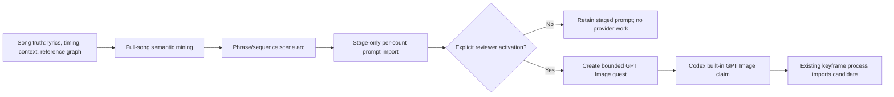

# Echo full-song visual screenplay contract

Status: planning contract. It adds a full-song reasoning and review layer above the existing four-count keyframe plan. It does **not** modify `process.json`, create a generation quest, call GPT Image, or activate video.

Schema: [`contracts/echo-full-song-visual-screenplay-v1.schema.json`](contracts/echo-full-song-visual-screenplay-v1.schema.json)

## Purpose

The screenplay makes an album-scale visual plan reviewable before a queue creates thousands of near-duplicate images. It separates four jobs that should not be conflated:

1. **Semantic mining**: identify what the song says, teaches, asks, and hides in wordplay/context.
2. **Scene direction**: turn the evidence into a sequence of locations, actions, materials, camera choices, and emotional transitions.
3. **Prompt staging**: import complete GPT Image prompts with evidence and seed provenance, but make them non-executable.
4. **Explicit activation**: create an image quest only when a reviewer deliberately activates one staged prompt.

The existing `echo-scene-keyframe-plan-v1` remains the runtime per-count state. This contract is an upstream editorial artifact. A later adapter may translate an *activated* screenplay count into the existing runtime prompt/image quest; it may never silently import all staged prompts as executable work.

## Authoring workflow



### 1. Mine semantics before selecting a scene

At the song level, record:

- the song thesis and emotional arc;
- the teaching, dilemma, or unresolved question;
- a motif lexicon that pairs each term with safe visual affordances and literalizations to avoid;
- the rule `reference-as-mechanic-not-copy` with `literalDepictionAllowed: false`.

At each count, extract lyric citations, concrete nouns, verbs, a metaphor, and the count-level teaching/question. Instrumental counts must record their cue/section context and say that lyric overlap is absent; they must not fabricate a lyric.

For every lyric-bearing count, the staged image prompt must visibly bind at least two mined elements—normally a concrete noun or symbol plus a verb or state change. Concepts and teachings should alter what the materials, bodies, space, or camera do. A generic portrait with matching mood is not sufficient.

### 2. Treat a reference as a mechanic, not a likeness

The graph may reveal a hidden reference through sound, spelling, translation, shared story mechanics, or a contextual layer. A selected connector must explain what it contributes *functionally*:

| Required field | Meaning |
| --- | --- |
| `connectorId` | Existing graph evidence being traversed. |
| `mechanic` | The reusable narrative/interaction principle, such as return-route, crew care, memory-as-object, threshold, or iterative repair. |
| `visualAffordance` | The non-branded scene/shot/material behavior the mechanic enables. |
| `nonLiteralTranslation` | How the frame carries the principle without copying a character, costume, logo, UI, quotation, or franchise scene. |
| `doNotDepict` | Any specific literalization that would be ungrounded, misleading, or infringing. |

If no evidence-backed connector applies, set `explicitNoReferenceApplies: true`; do not invent a connector just to fill metadata.

The album context reservoir may still contribute a non-inherited mechanic when it materially improves the scene. This does not become evidence that the current lyric references that work. The screenplay must label it `notEvidenceOfSongReference: true` and translate it into original cinematic behavior. References are useful for diversity when they change action, causality, spatial logic, material behavior, viewpoint, or consequence; merely naming a theme is decorative and should fail review.

### 3. Build a sequence, not isolated prompts

Plan phrase-sized sequences of 3–8 counts before writing individual prompts. Each count must define a location, visible action or state change, primary motif, camera, composition, lighting, and energy.

Sequence phases such as beginning, pressure, turn, and release belong in screenplay metadata. Do not stamp the same phase labels or sentence scaffold into every GPT Image prompt. Shared avatar-seed and safety language may repeat where operationally required, but the cinematic body of each prompt must be individually written from that count's lyric evidence, inherited material state, and consequence for the next shot.

The schema requires a diversity gate. Its default policy is intentionally strict:

- at most two adjacent duplicate visual tuples, measured from location, camera, composition, primary motif, action, and energy;
- every count has an action or state change;
- a hold is allowed only with `intentionalHold: true` and a specific `holdReason`;
- repeated tuples require a reviewer-visible repetition result.

Continuity belongs to Avatar identity, carried material, or scene consequence—not indefinitely to one lens, one pose, and one corridor.

### 4. Preserve Avatar identity while allowing cinematography to move

`avatarContinuity` supplies 1–3 content-hashed Red/Blue/Green seed assets. It records:

- identity invariants for each Avatar;
- global invariants (for example, face, silhouette, palette markers, and characteristic accessory);
- allowed variation (shot scale, posture, environment, lighting, and camera angle);
- whether the source seed must be sanitized before use because incidental pseudo-text or markings conflict with the no-logo/no-readable-text policy.

The seed is an identity reference, not a command to repeat the same full-body pose or background.

Incidental figures or animals visible in an approved seed are not an automatic rejection. Image review prioritizes lyric/context attachment, visible action, reference payoff, composition, and continuity. An incidental subject fails only when it displaces the count's main action, invents an unsupported relationship, or makes multiple frames collapse into the same seed-derived tableau.

### 5. Finalize only mechanical metadata

The direct-LLM author leaves `promptHash`, authoring `artifactHash`, its attestation hash, and screenplay `provenance.contentHash` as `pending`. A separate deterministic finalizer may calculate **only** those values. It must not author, rewrite, normalize, shorten, or expand semantic extraction, scene direction, shot fields, prompts, negative prompts, or justifications.

```bash
npm run echo:screenplay:finalize -- \
  --process data/echo-scene-keyframes/process.json \
  --screenplay path/to/llm-candidate.json \
  --output path/to/finalized-candidate.json \
  --requested-model gpt-5.6-terra \
  --agent-task-name /root/full-song-author \
  --source-packet-hash sha256:<packet-hash> \
  --instruction-hash sha256:<instruction-hash> \
  --started-at <ISO> --completed-at <ISO> \
  --attested-by /root/full-song-author --attested-at <ISO> \
  --created-by screenplay-metadata-finalizer --created-at <ISO> \
  --apply
```

Dry-run is the default. A write requires a distinct output path, a paused process, and zero active claims. The finalizer never alters process state, activates an image, claims a quest, calls a provider, installs media, or touches held video state.

The canonical screenplay hash covers the entire finalized document—including scene/semantic text, prompts, prompt hashes, seed provenance, authoring attestation, review state, and generation policy—except for the `provenance.contentHash` field itself, which is removed from the hash preimage to avoid self-reference. Both runtime import validation and the standalone validator recompute this hash; a declared value is never trusted.

## Staging and activation states

`prompt.executionMode` is always `stage_only` inside this contract. A staged or approved prompt is a review artifact, not permission to generate an image.

| State | Meaning | Provider work allowed? |
| --- | --- | --- |
| `prompt.status: staged` | Imported with evidence, awaiting editorial decision. | No |
| `prompt.status: approved` | Editorially acceptable, still dormant. | No |
| `imageActivation.status: not_requested` | Default and required for unselected frames. | No |
| `imageActivation.status: requested` | An explicit activation record names the approved prompt hash and requestor. | A bounded quest may be created. |
| `imageActivation.status: claimed/complete/failed` | Runtime-owned state after handoff to the existing keyframe process. | Only through that process. |

Activation must bind `approvedPromptHash`, a request identity/time, the approved provider policy (`codex-built-in-gpt-image-only`), and a bounded image quest ID. Changing source hashes, prompt content, seed assets, or reference evidence makes the staged prompt stale and requires a new explicit activation.

Independent approval is an external receipt bound to the immutable staged screenplay hash and authoring-provenance hash. Do not mutate `review.status` merely to record approval after hashing; doing so would invalidate the artifact that was reviewed. Import accepts a `staged` screenplay only when the separate `independent_screenplay_review` receipt validates and is authored by a different actor.

Video remains `held-until-separately-enabled`; a screenplay cannot authorize it.

## Runtime handoff rules

1. Validate the screenplay as read-only planning input.
2. Perform editorial review for semantic grounding, sequence diversity, reference-as-mechanic use, and Avatar continuity.
3. Activate only the selected count(s).
4. Create the ordinary keyframe prompt/image quest using the staged prompt’s immutable hash and the existing claim protocol.
5. Let the existing operations process own GPT Image, output import, card registration, review, pause/resume, retry, and video hold behavior.

No direct JSON write to `data/echo-scene-keyframes/process.json` is permitted by this contract.

## Validation

The repository provides a read-only validator:

```bash
npm run echo:screenplay:validate -- --file path/to/screenplay.json
```

With no screenplay files staged in `data/echo-scene-keyframes/screenplays/`, it exits successfully and reports that nothing is awaiting validation. The validator checks the high-value operational rules that are hard to express in basic JSON schema alone: staged-only prompt mode, explicit activation linkage, nonliteral reference mechanics, four-beat timing windows, adjacent repetition gates, canonical per-count prompt hashes, and the recomputed canonical screenplay content hash.

## Ownership

- **Avatar Builder / Echo Director:** owns screenplay files, editorial review, and the explicit handoff contract.
- **Song Registry:** remains read-only source truth for songs, lyric timing, and audio context.
- **Reference graph:** supplies cited connectors and their provenance; it does not grant permission to copy protected imagery.
- **Existing Echo keyframe process:** owns runtime claims, image installation, media-card candidacy, throttling, recovery, and pause/resume.
- **Codex built-in GPT Image:** is the only image provider permitted when an activated runtime quest is claimed.
