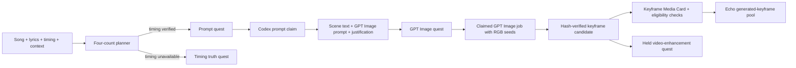

# Echo Scene Prompt and Keyframe Pipeline

Status: First-pass design and Kanban plan. Image generation is now separately authorized through the bounded Codex-only process documented in `ECHO_SCENE_KEYFRAME_OPERATIONS.md`; this document still does not authorize OpenAI API dispatch or video generation.

## Outcome

Give every truthfully measurable four-count window in an Echo song an inspectable creative state:

1. Codex analyzes the lyrics, music cues, song context, reference graph, output profile, and neighboring windows.
2. Codex writes a short scene beat, a GPT Image prompt, negative constraints, and a lyric-grounded justification.
3. The prompt cites one or more existing Red, Blue, or Green Avatar images as visual seeds.
4. A prompt quest becomes an image-generation quest only after the prompt exists.
5. A completed image becomes a provenance-bearing keyframe Media Card and, after eligibility checks, enters a new Echo Director casting pool.
6. A video-enhancement quest is appended after the keyframe exists, but remains held and cannot be claimed until a later operator decision enables video generation.

The feature is additive. Existing Director cuts, media selections, Song Card editions, Avatar media, and original lyrics remain unchanged.

## Existing jump-off points

- `hapa.director.song-context-packet.v1` already content-hashes the song, linked Avatars, Cards, scenes, relationships, and media attach packs.
- Director v2 already distinguishes verified lyric timing, measured/external beat timing, inferred timing, and quarantined grids.
- `hapa.director.missing-media-plan.v1` already creates bounded generation requests with framing, continuity, source anchors, and output dimensions.
- `hapa.media.generated-candidate.v1` already requires source node, operator, content hash, local path, dimensions, prompt, model, and review state.
- The unified media catalog and Builder-eligible Director pass already consume typed, content-addressed media without rewriting source assets.
- The Hapa Media Generation Queue already provides seed, claim, running, complete, fail, throttle, output, and provenance behavior.

## Four-count truth contract

A four-count is four consecutive beats, not four seconds and not an assumed uniform grid.

- Anchor the first window to a verified downbeat or a source-backed beat-map anchor.
- Store `[beatStart, beatEndExclusive)` and `[startSeconds, endSeconds)` as half-open ranges.
- Preserve meter and tempo changes. A count remains four beats even when its duration changes.
- The final count may be partial only when explicitly labeled `partial-final-count`.
- A song with missing, quarantined, or fabricated-looking beat timing enters `needs_timing_truth`. It receives a timing-resolution quest and does not receive invented four-count windows.
- Lyric citations are selected by actual overlap with the count window. Preceding or following lyrics may be included only as labeled continuity context.

This keeps prompt coverage from laundering synthetic timing into Director truth.

## State model

Prompt, image, and video facts are tracked independently. The UI may derive a compact aggregate state, but no single mutable status is allowed to erase a prior artifact or quest receipt.

| Lane | Artifact state | Quest state | Meaning |
| --- | --- | --- | --- |
| Prompt | `missing`, `ready`, `stale`, `failed` | `not_open`, `open`, `claimed`, `complete`, `failed` | Codex scene text, GPT Image prompt, constraints, and justification. |
| Image | `missing`, `candidate`, `keyframe_exists`, `stale`, `failed` | `blocked_by_prompt`, `not_open`, `open`, `claimed`, `complete`, `failed` | GPT Image output and its Media Card registration. |
| Video | `missing`, `candidate`, `video_exists`, `stale`, `failed` | `blocked_by_keyframe`, `held`, `open`, `claimed`, `complete`, `failed` | Future image-to-video derivative. Version 1 creates only a held quest. |

Derived count states are:

- `needs_timing_truth`
- `missing_prompt`
- `prompt_quest_open`
- `prompt_ready`
- `image_quest_open`
- `keyframe_candidate`
- `keyframe_exists`
- `video_quest_held`
- `video_exists`
- `stale`

`keyframe_exists` is a factual statement that a hash-verified local image exists. `eligibleForDirector` is stricter and additionally requires output conformance, seed and prompt provenance, rights/consent state, safety checks, and the configured review gate.

## Scene prompt packet

Each count gives the Codex prompt agent a bounded packet rather than an entire unstructured store:

- Song ID, title, immutable source revision, output profile, and Director treatment ID.
- Exact count time/beat range and timing provenance.
- Overlapping lyric lines with line/timing citations.
- Section, phrase, edit cue, energy envelope, active stems, accents, and camera intent.
- Relevant song-context nodes, reference connectors, contextual layers, and their truth/review status.
- Previous and next count summaries for continuity.
- Selected Red/Blue/Green seed assets with Avatar ID, Media Card/asset ID, local retrieval handle, content hash, crop/pose role, rights state, and source lineage.
- Negative constraints from the song packet and seed assets.

The agent must return:

- `sceneText`: one concise description of what the frame depicts.
- `gptImagePrompt`: a production prompt describing subject, action, environment, composition, lighting, palette, lens/framing, energy, and continuity.
- `negativePrompt`: exclusions such as unwanted text, unlisted characters, identity drift, extra limbs, wardrobe drift, or prohibited visual claims.
- `justification`: why the image fits this count.
- `evidence`: lyric citations, cue IDs, context-node IDs, and reference-connector IDs supporting the decision.
- `seedUse`: what each seed contributes and what must remain visually consistent.
- `continuity`: what should carry from the previous frame and leave room for the next frame.
- `confidence` and explicit `gaps`.

The exact prompt request is content-addressed from its inputs. Codex output is stored with agent/model/run provenance; it is not described as deterministic simply because its request identity is stable.

## Red, Blue, and Green seed selection

Canonical Avatar identities in the current Builder store are:

- Red: `red-reaper`
- Blue: `avatar-2`
- Green: `avatar-3`

Every prompt uses at least one verified image from those three Avatars. Use up to three when the lyric/context warrants a shared frame.

Selection order:

1. Explicit performer, relationship, or Avatar link in the song context.
2. Character or role evidence in the current lyric/reference window.
3. Visual-energy casting, clearly labeled as direction rather than canon:
   - Red: heat, forward action, conflict, percussion, ignition, refusal.
   - Blue: water, memory, reflection, voice, night, navigation.
   - Green: growth, repair, nature, balance, world-building, shelter.
4. Stable fallback rotation seeded by song ID and count ordinal.

Only technically available, content-hashed source images may be sent to GPT Image. A missing suitable RGB asset blocks the image quest with `seed_asset_missing`; it does not silently substitute another person.

## Quest and queue behavior

The per-count quests belong in the media-generation/quest store, not as thousands of individual Overwatch Kanban cards. The Kanban tracks implementation slices and album-level checkpoints.

Rules:

- Prompt completion opens the image quest; it never generates an image implicitly.
- Only a claimed image job may invoke GPT Image.
- Completion imports the output into bounded local media storage, attaches provenance, and records the content hash.
- A failed claim remains retryable without deleting the prompt or prior attempts.
- Input hash changes mark affected prompts/images/videos `stale`; they do not overwrite prior artifacts.
- Video quests use `executionPolicy: hold-video-generation-v1`. They are visible and countable but excluded from provider claims.
- Album jobs are throttled and resumable. Prompt planning may run in batches, while image generation remains separately claim-limited.

## Media Card eligibility pool

Add `echo-scene-keyframe` as a source group in the unified media catalog and Director casting telemetry.

A keyframe becomes eligible only when it has:

- A local, nonzero, hash-verified image.
- Exact or explicitly accepted output-profile dimensions/aspect.
- Prompt request and Codex output receipts.
- Red/Blue/Green seed asset IDs and hashes.
- Song ID, count ID, beat/time range, lyric citations, context hash, and Director treatment lineage.
- Rights/consent and safety states required by the existing media-card contract.
- No unresolved identity or unlisted-character violation.
- Human review state required by the chosen casting policy.

Eligible keyframes participate in the existing least-used/diversity logic. The Director may rank them highly for their own count, but must still expose alternatives and must never silently replace a locked or approved shot.

## UI design

Add a `Scene Prompts` track/panel to Echo Director:

- Album coverage counters: timing-ready counts, missing prompts, prompt-ready, image quests, keyframe candidates, keyframes, held video quests, and videos.
- A count strip aligned to the actual waveform/timeline, with one compact state glyph per four-count.
- Count inspector with lyrics, energy/stems, context references, seed thumbnails, scene text, prompt, negative prompt, justification, evidence, and provenance.
- Actions: create/retry prompt quest, claim with Codex, approve/edit prompt, create/claim image quest, register/review keyframe, and inspect the held video quest.
- Clear stale badges with the exact changed input family.
- Filters for missing prompt, prompt ready, image ready, keyframe eligible, video held, and failure.

UI actions must have API and CLI equivalents. The trusted local UI may use its process-scoped session; direct mutation APIs/CLI remain authenticated according to the existing Builder policy.

## API and CLI shape

Planned API families:

- `GET /api/echo/scene-keyframes? songId=`
- `POST /api/echo/scene-keyframes/plan`
- `POST /api/echo/scene-keyframes/prompts/claim`
- `POST /api/echo/scene-keyframes/prompts/complete`
- `POST /api/echo/scene-keyframes/images/queue`
- `POST /api/echo/scene-keyframes/images/claim`
- `POST /api/echo/scene-keyframes/images/complete`
- `POST /api/echo/scene-keyframes/review`

Planned CLI families:

- `echo-scene plan --song <id>`
- `echo-scene prompt-claim --limit 1`
- `echo-scene prompt-complete --quest <id> --result <json>`
- `echo-scene image-claim --limit 1`
- `echo-scene image-complete --quest <id> --local-path <png>`
- `echo-scene audit --song <id>`

Dry-run is the default for planning/backfill commands; writes require `--apply` and create normal backups/reports.

## Invalidation and lineage

The following input families independently invalidate a count:

- Lyrics or lyric timing.
- Beat/downbeat timing.
- Song context or reference graph.
- Director treatment/output profile.
- Seed selection or seed asset bytes.
- Prompt policy/model contract.
- Neighboring approved continuity frame.

The invalidation report names changed families and affected count IDs. Unaffected prompts and assets remain reusable. Approved or generated artifacts are append-only children; regeneration creates a new attempt and never rewrites the old file or receipt.

## Rollout

Pilot with three complementary source-verified songs:

- `Dear Papa`: lyric-rich baseline with Red attached and no reference-graph dependency.
- `Gates at the Mountain`: dense direct Robin Hobb reference braid and verified lyric timing.
- `Save Point (Found You in the Code)`: explicit LitRPG mechanics, reference layers, and verified lyric timing.

Pilot gates:

- Every verified four-count has exactly one current state projection.
- Re-running unchanged inputs creates no duplicate quests.
- Every prompt cites actual lyrics/cues and at least one hash-verified RGB seed.
- A changed lyric, beat map, output profile, or seed hash invalidates only affected counts.
- GPT Image cannot run without a claim.
- Imported images become candidate Media Cards; only conforming/reviewed Cards enter the pool.
- Video quests are appended and visible but remain unclaimable.
- Existing Director cuts and Song Card editions remain byte-identical.

After the pilot, run a dry album audit to estimate count volume, prompt/token load, seed coverage, image cost exposure, storage, and video-quest backlog before authorizing an album-wide generation pass.

## Subscribers and ownership

- Avatar Builder owns authored count state, prompt artifacts, generated candidate registration, and Director eligibility projection.
- Hapa Song Registry remains read-only truth for song/audio/stem/lyric identities.
- Hapa Media Generation Queue owns generation job claims, throttling, attempts, and completion receipts.
- Avatar Cards own Red/Blue/Green seed images; using them as derivation inputs does not transfer custody.
- Echo Director consumes eligible keyframe Cards.
- Quest Keeper/Overwatch consumes aggregate implementation and coverage telemetry, not one task per count.
- Second Brain/wiki may receive bounded provenance summaries after the owning flow defines that writeback.
- Song Card minting sees a keyframe only when a saved Director cut actually uses it.

## Deferred from version 1

- Actual video generation or provider claims.
- Automatic promotion of generated images into canon.
- Automatic replacement of approved Director shots.
- Fabricated beat grids for songs without timing truth.
- Cross-song identity blending that lacks an explicit reviewed relationship/context route.
